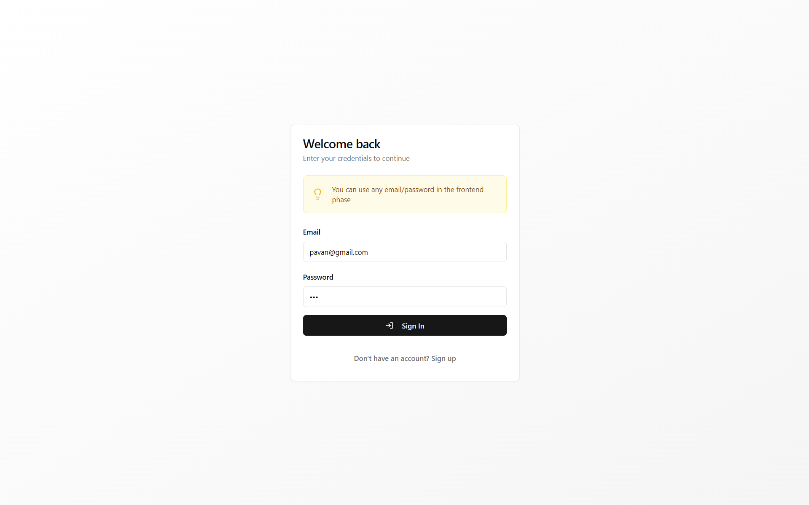
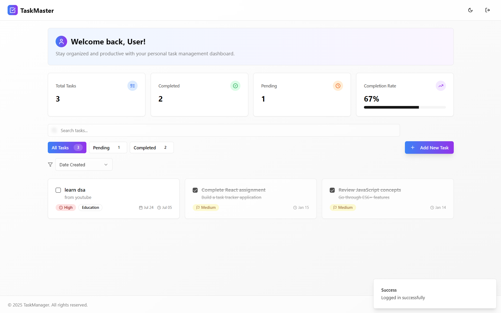
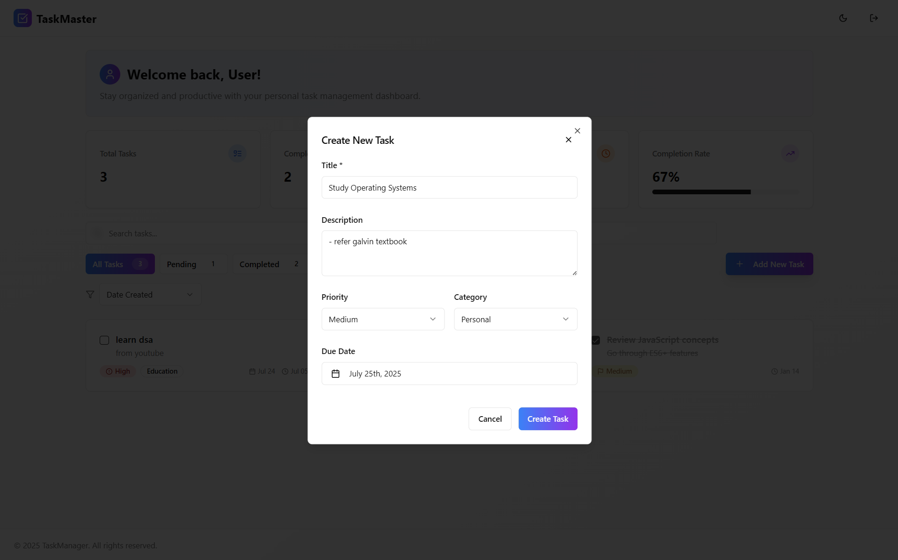
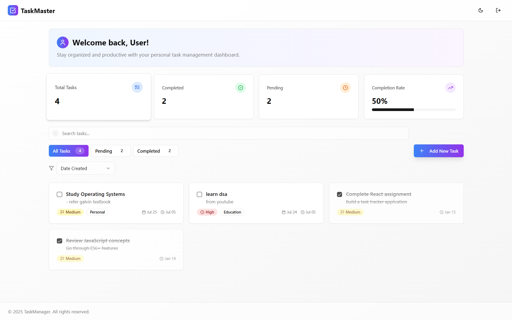
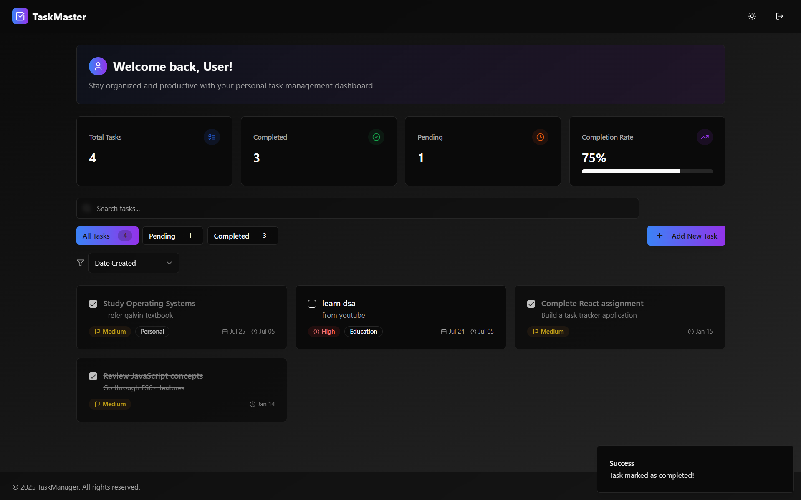

# Personal Task Tracker

## 📖 Description

A modern, intuitive personal task management application that helps you organize, track, and manage your daily tasks with a clean, responsive interface.

## 🚀 Features

- Add, edit, and delete tasks
- Mark tasks as completed or pending
- View dynamic task statistics (total, completed, pending)
- Tasks persist in localStorage
- Responsive design with Tailwind CSS
- Dark / Light Modes
- Priority and Date Setting

## 🛠️ Setup Instructions

1. Clone the repository
2. Run `npm install`
3. Run `npm start`
4. Open [http://localhost:5173](http://localhost:5173)

## 🧰 Technologies Used

- React.js
- TypeScript
- Tailwind CSS

## 🔗 Live Demo

[Link to deployed application]

## 🖼️ Screenshots

